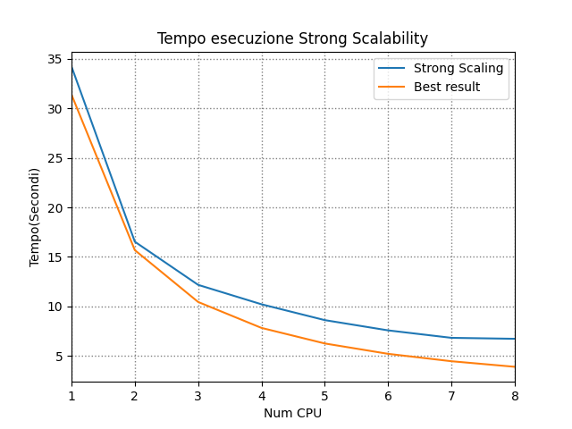
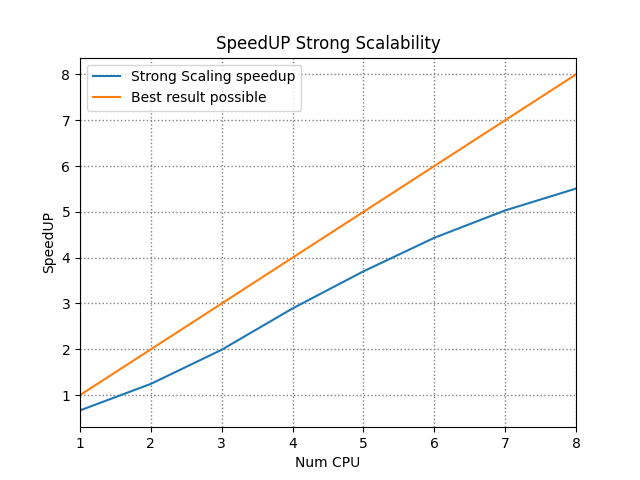
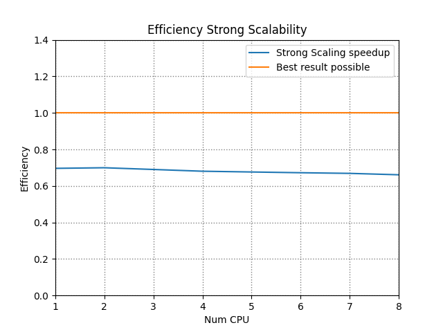
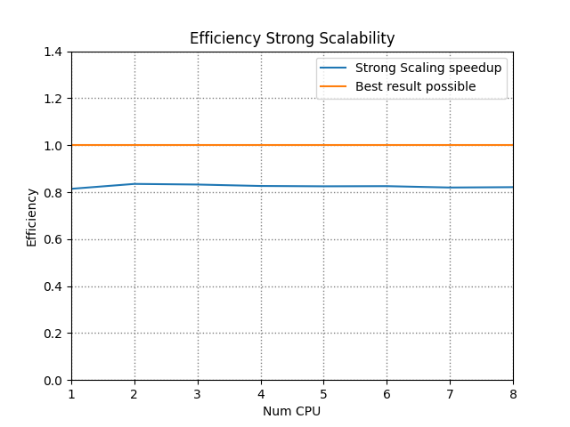

# Introduzione

Il problema Word Count consiste nel determinare quante occorrenze di ogni determinata parola compaiono in un file. Il conteggio delle parole può essere necessario quando un testo deve rientrare entro dei limiti. Viene anche usato per determinare il prezzo di traduzioni o articoli giornalistici. Problema estremamente di facile risoluzione, ma che prevede una sfida per l'elaborazione su grandi quantità di dati.

In queste pagine sarà spiegata la mia personale soluzione al problema proposto.

# Breve descrizione della soluzione

Di seguito è presentata una soluzione al problema Word Count in ambiente distribuito dove tutti i nodi che collaborano alla soluzione hanno accesso agli stessi dati. L'input fornito al programma è composto da una directory con all'interno vari files, e l'output è un file CSV con la lista delle parole contenute nei file associati e il loro numero di occorrenze.

La soluzione è raggiunta mediante un programma scritto in C, usando il paradigma Message Passing proprio della libreria MPI [^1].

Per semplicità ho creato i file in modo da tenere su ogni riga una parola. Di fatti per estendere questa soluzione ad un approccio reale basterebbe applicare ai file una parte di pre-processing, in cui dei testi vengono "ripuliti" da tutti i simboli e salvati in un nuovo file di testo come da soluzione.

**La mia soluzione** lavora sul numero di linee e le parole in un file. Prima di tutto calcolo il numero di parole totali e le divido per il numero di processori totali. Successivamente ogni processore leggerà e conterà solo il numero di parole assegnatogli aprendo il file e cominciando ad analizzare solo le linee indicate.

## Architettura

La soluzione si compone delle seguenti fasi:

1. **NODO MASTER:**

   - Calcola numero parole per ogni file e il loro totale;
   - Calcola numero parole che ogni processore dovrà analizzare;
   - Compone la struttura che sarà mandata ad ogni processore per indicare la linea di start e la linea di end delle parole da contare;
   - Anche il nodo MASTER prende parte alla computazione prendendosi la sua parte di parole dallo split iniziale.

2. **NODI SLAVE:**

   - Riceve la struttura dal MASTER;
   - Conta le parole e riempie una struttura apposita contenente le parole e la loro frequenza;
   - Ritorna queste informazioni al MASTER.
  
3. **NODO MASTER:**

   - Riceve le strutture e combina i risultati. Questo perchè in file diversi possiamo avere più occorrenze della stessa parola;
   - Scrive un file CSV con i risultati.

# Dettagli dell'implementazione

Di seguito illustrero qualche parte che ritengo interessante lato codice:

```c
typedef struct
{
    char fileName[MAXFILENAME];
    int rank;
    int start;
    int end;
}PartitionedWord;
```

Questa struttura verrà riempita con le indicazioni da passare ai processori per l'analisi:

- fileName: nome del file dal quale leggere le parole;
- rank: processore che leggerà queste parole;
- start: riga dalla quale cominciare a leggere;
- end: riga dove fermare la lettura.

Distrubuzione delle parole per ogni processore, in questo modo ogni processo elabora

$$
\frac{numeroTotaleParole}{proc}
$$

con uno scarto di 1(per un solo processore) nel caso di numeroTotaleparole non divisibile, e dunque l'array di struct sarà così formato:

| Proc | fileName  | startLine | endLine |
| ---- | --------- | --------- | ------- |
| 0    | file1.txt | 0         | 19      |
| 0    | file2.txt | 0         | 59      |
| 1    | file2.txt | 60        | 99      |
| 1    | file3.txt | 0         | 39      |
| 2    | file3.txt | 40        | 99      |
| 2    | file4.txt | 0         | 19      |
| 3    | file4.txt | 20        | 99      |
| ...  | ...       | ...       | ...     |

Ciò si legga come: "Il processore 0 legge dal file1.txt, da riga 0 a 19 (20 parole lette)" ecc...

\newpage

Questa è la funzione con cui viene riempita la struttura presentata in precedenza:

```c
int wordForProcessor(PartitionedWord *w, int *wordForProcessor, FileWordSize *fileInfo, int proc)
{
//...
    while (i < proc)
    {
        w[j].rank = i;
        w[j].start = offset;
        int difference = wordForProcessor[i] - (fileInfo[k].wordNumber - offset);
        if (difference >= 0) 
        {
            wordForProcessor[i] = wordForProcessor[i] - fileInfo[k].wordNumber + offset;
            w[j].end = fileInfo[k].wordNumber - 1;
            strcpy(w[j].fileName, fileInfo[k].fileName);
            offset = 0;
            j++; k++;
            if(wordForProcessor[i] == 0)
                i++;
        }
        else
        {
            w[j].end = wordForProcessor[i] + offset - 1;
            offset = w[j].end + 1;
            wordForProcessor[i] = 0;
            strcpy(w[j].fileName, fileInfo[k].fileName);
            i++; j++;
        }
    }
    return j;
}
```

La funzione presentata di seguito, si occupa di unire le parole del processore master, con le parole che riceviamo dagli altri processori. Questa viene usata perchè quando ricevo delle parole posso avere la stessa parola anche in altri file che magari sono stati analizzati da altri processori, quindi devono essere comparare e nel caso sommate le frequenze.

```c
int mergeWords(Word *words, Word *words_received, int sizeForProcessor, int sizeOfZero)
{
    int j;

    for (int i = 0; i < sizeForProcessor; i++)
    {
        for (j = 0; j < sizeOfZero; j++)
        {
            if (strcmp(words_received[i].word, words[j].word) == 0)
            {
                words[j].freq += words_received[i].freq;
                break;
            }
        }
        if (j == sizeOfZero) // no word
        {
            strcpy(words[j].word, words_received[i].word);
            words[j].freq = words_received[i].freq;
            sizeOfZero++;
        }
    }
    return sizeOfZero;
}
```

# Istruzioni per l'esecuzione

Per la compilazione è stato usato CMAKE[^3]. Di seguito sono indicati i passi per poter eseguire in autonomia la compilazione e l'esecuzione:

**Build and compile:**

```bash
bash run.sh
```

Tutti i binari vengono aggiunti alla cartella appena creata `build`.
Quindi dare: `cd build`:

**Per esecuzione su un cluster di macchine**

```bash
mpirun -np <NUM_PROCESSOR> --hostfile <HOSTFILE> src/word-count --path <PATH_FILE_DIR>
```

**Per l'esecuzione di test su una singola macchina**

```bash
mpirun -n <NUM_PROCESSOR> src/word-count --path <PATH_FILE_DIR>
```

**Per lanciare un esempio veloce, dopo la compilazione può essere eseguito questo comando**

```bash
mpirun -n 4 src/word-count --path ../resources/4mb_file/
```

# Benchmarks

La soluzione è testata in un ambiente distribuito per constatarne la correttezza e la scalabilità. L'input è pensato per essere quanto simile ad un esempio reale e pratico.
Le metriche utilizzare per la valutazione delle prestazioni sono:

1. **Speedup** *(S)*: indica l'incremento prestazionale sullo stesso input tra l'esecuzione sequenziale e quella distribuita; Per *n* processori lo speedup massimo deve essere *n*; Questo dato ci indica quanto l'algoritmo è capace di sfruttare l'incremento prestazionale;
2. **Efficienza** *(E)*: definisce la bontà della soluzione indicando quanto i tempi di esecuzione sequenziale e distribuita si avvicinino. In questo dato l'upper-bound è 1.

$$
S =\frac{Tempo_{sequenziale}}{Tempo_{parallelo}}
$$

$$
E = \frac{Tempo_{sequenziale}}{n * Tempo_{parallelo}}
$$

## Architettura di testing

I benchmark sono stati condotti su **cloud AWS** in cui è stato messo appunto un cluster di 8 istanze EC2 modello **c5.large**.

> Le istanze C5 di Amazon EC2 forniscono prestazioni elevate a costi ridotti con un rapporto ottimale tra prezzi e potenza di calcolo, per eseguire carichi di lavoro avanzati a utilizzo intensivo di calcolo. Sono inclusi carichi di lavoro come server web ad alte prestazioni e High Performance Computing (HPC)[^2].

Ogni istanza m5.large ha queste caratteristiche:

- Intel Xeon Scalable 2a Gen/Intel Xeon Platinum serie 8000 (Skylake-SP) (2vCPU);
- 4GB RAM;
- Fino a 25 Gbps di larghezza di banda di rete;
- Fino a 4.750(Mb/s) larghezza di banda EBS;
- 20 GB storage EBS.

Le macchine hanno come Sistema Operativo *Ubuntu 20.04 (LTS) Focal Fossa - (ami-083654bd07b5da81d)* e nessun software aggiuntivo installato(oltre quelli compresi nell'ami). Inoltre l'applicativo è l'unico in esecuzione, questo per evitare di avere misurazioni contraffatte.

### Dataset

Il dataset preso in considerazione è composto da 1 file txt, con 3999999 parole italiane all'interno. Le parole sono disposte una su ogni riga. La dimensione del file è $\approx$ 4Mb.

## Esperimenti

Gli esperimenti condotti sono stati definiti per verificare la capacità della soluzione proposta di scalare in un ambiente distribuito reale.

> Per scalabilità si intende la capacità di un sistema di aumentare o diminuire le proprie performance in funzione delle necessità e disponibilità di risorse. La scalabilità può essere intesa come *verticale ed orizzontale*. Per **scalabilità verticale** si intende aumentare le risorse di una singola macchina (esempio, passare da 2 Gb Ram a 4Gb Ram), mentre per **scalabilità orizzontale** si intende invece aumentare le risorse ma andando ad incrementare i numeri di nodi che concorrono nella computazione.


Si noti che benchè le macchine EC2 c5.large posseggano 2 vCPU, i test sono stati lanciati su 1CPU che è l'effettivo core fisico. Queste macchine di fatti offrono si 2 vCPU, ma sono sfruttati in hyperthreading e quindi non utile ai nostri benchmarks[^4].

Per verificare la bontà della mia soluzione, ho eseguito i benchmark applicando la scalabilità orizzontale. Questa metrica si divide ulteriormente in due metriche differenti:

- **Strong** Scalability;
- **Weak** Scalability.

### Strong Scalability

In questo tipo di scalabilità la taglia dell'input resterà costante. Dunque questo dato ci permetterà di capire quanto l'applicativo velocizza il calcolo in una certa istanza del problema all'aumentare dei nodi.

La *Strong scalability speedup* viene calcolata con la seguente formula:

$$
\\S_{strong}=(\frac{t_{1}}{t_{n}})
$$

- *n*: numero di nodi;
- *t~1~* tempo di esecuzione per 1 nodo;
- *t~n~* il tempo per n nodi.

La *Strong scalability efficiency* viene calcolata con la seguente formula:

$$
\\E_{strong}=(\frac{t_{1}}{n*t_{n}})
$$

- *n* numero di nodi;
- *t~1~* tempo di esecuzione per 1 nodo;
- *t~n~* il tempo per n nodi.

Di seguito sono state graficate le misurazioni:







### Weak scalability

In questo tipo di scalabilità si verificano le prestazioni di un applicativo software quando l'input cresce proporzionalmente al numero dei nodi. In questo modo si può stimare l'impatto dell'overhead derivante dalla comunicazione nell'ambiente distribuito sulle performance dell'applicazione.

| Proc | 1  | 2 | 3 | 4 | 5 | 6 | 7 | 8 |
| ---- | --------- | --------- | ------- | --------- | ------- | --------- | ------- |
| N.word| 499999  | 999998 | 1499997 | 1999996 | 2499995 | 2999994 | 3499993 | 3999992 |

La *Weak scalability efficiency* è calcolata con questa formula:  

$$
\\E_{weak}=\frac{t_{1}}{t_{n}}
$$

- *n* numero di nodi;
- *t~1~* tempo di esecuzione per 1 nodo;
- *t~n~* il tempo per n nodi.

Di seguito sono state graficate le misurazioni:



# Conclusioni

Ho presentato una possibile soluzione al problema Word Count, che consiste nel determinare il numero di occorrenze di ogni parola presente in un file/insieme di file. La soluzione è stata scritta usando il paradigma di message passing proprio di MPI.
La soluzione mostra scarsa stabilità del software, per quanto riguarda lo speedUp, mentre c'è un'ottima stabilità quando si parla di efficienza fra la scalabilità Strong e scalabilità Weak.

La soluzione può ovviamente essere migliorata. Si deve tenere anche conto che i tempi misurati tendono comunque ad aumentare aggiungendo una fase di pre-processing.

[^1]: https://www.mpi-forum.org/docs/mpi-3.1/mpi31-report.pdf
[^2]: https://aws.amazon.com/it/ec2/instance-types/c5/
[^3]: https://cmake.org/
[^4]: https://aws.amazon.com/it/ec2/physicalcores/
